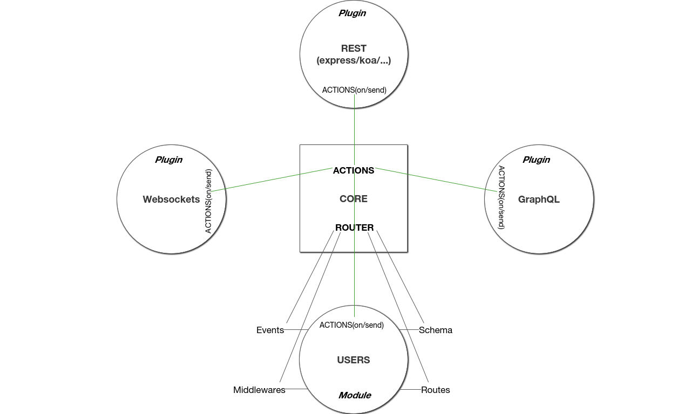

# <p align="center"><a href='https://github.com/Dugnist/jsberry'></a><br/> JSBerry </p>

[](https://github.com/Dugnist/jsberry/pulls)
[](https://github.com/Dugnist/jsberry/commits/master)
[](https://github.com/Dugnist/jsberry)
[](https://github.com/Dugnist/jsberry/issues)
[](https://github.com/Dugnist/jsberry/pulls)
[](https://github.com/Dugnist/jsberry/releases)
[](https://github.com/Dugnist/jsberry/blob/master/LICENSE)

JSBerry is open source modular simple architecture for building Node.js applications.

JSBerry is not a framework. It's a solution for creating applications using any frameworks, modules and plugins.

<a href="https://dugnist.gitbooks.io/jsberry">Documentation</a>

<a href="https://github.com/Dugnist/jsberry/blob/master/STORE.md">Modules and plugins store</a>


<p align="center"></p>


## Quick start

```bash
git clone https://github.com/Dugnist/jsberry project
cd project
npm i
```

If you wanna use express as default framework - you need to run this script to install "express" dependencies:
```bash
npm run install-express
```

And finally - start your application:

```bash
npm start
```


If you wanna install another framework instead of "express" - you can check <a href="https://github.com/Dugnist/jsberry/blob/master/STORE.md">Modules and plugins store</a>.


Also you can check `src/core/config/index.js`
to set key `"framework"` to your framework name (default "express").

## List Of Scripts

- `npm start` - run application with development mode
- `npm run prod` - run application with production mode
- `npm run inspect` - run application with node debugger (dev mode)
- `npm run check` - run npm modules vulnerabilities checker (`npm i nsp -g`)
- `npm run protect`- run npm modules vulnerabilities checker (`npm i snyk -g`)
- `npm run install-express`- install all dependencies for default express module

## Docker

Check default Dockerfile for remove the line `RUN npm run install-express`
if you use another framework instead "express".

Add yourself to the docker group to enable running docker commands
without prefixing with `sudo`:

```bash
  sudo groupadd docker
  sudo chown root:docker /var/run/docker.sock
  sudo chown `$USER`:docker /home/`$USER`/.docker/config.json
  sudo usermod -a -G docker $USER
  reboot
```

To build simple Docker jsberry image:

```bash
  sudo docker build -t `$USER`/jsberry .
```

To run build:
```bash
  sudo docker run -p 8080:8000 -d `$USER`/jsberry
```

To restart container automatically:

```bash
  sudo docker run -dit --restart unless-stopped `$USER`/jsberry
```

To remove unused (none:none) images use:

```bash
  sudo docker rmi $(sudo docker images -f "dangling=true" -q)
```

## Debugger

Run `npm run inspect` and open this url in browser:

```bash
chrome-devtools://devtools/bundled/inspector.html?experiments=true&v8only=true&ws=127.0.0.1:9229/${uuid}
```

where "uuid" - debug session id from console.

OR:

Install extension <a href='https://chrome.google.com/webstore/detail/nodejs-v8-inspector/lfnddfpljnhbneopljflpombpnkfhggl'>nodejs-v8-inspector</a> and launch it on 9229 port.

## What's new?

You can check our <a href="https://github.com/Dugnist/jsberry/blob/master/ROADMAP.md">ROADMAP</a> and propose new features.

## Community support

For general help using JSBerry, please refer to the official <a href="https://dugnist.gitbooks.io/jsberry">documentation</a>. For additional help, you can use ask question here:

  - <a href="https://t.me/joinchat/Ell7tkiTmlo8WvGgRu2aoA">Telegram</a> (realtime support)
  - <a href="https://www.facebook.com/messages/t/Dugnist">Facebook</a>

## Author

**Dugnist Alexey**

- <https://www.linkedin.com/in/Dugnist>
- <http://github.com/Dugnist>
- <https://www.facebook.com/Dugnist>


## Copyright and license

Code and documentation copyright 2017-2018 JSBerry. Code released under [the MIT license](LICENSE).
